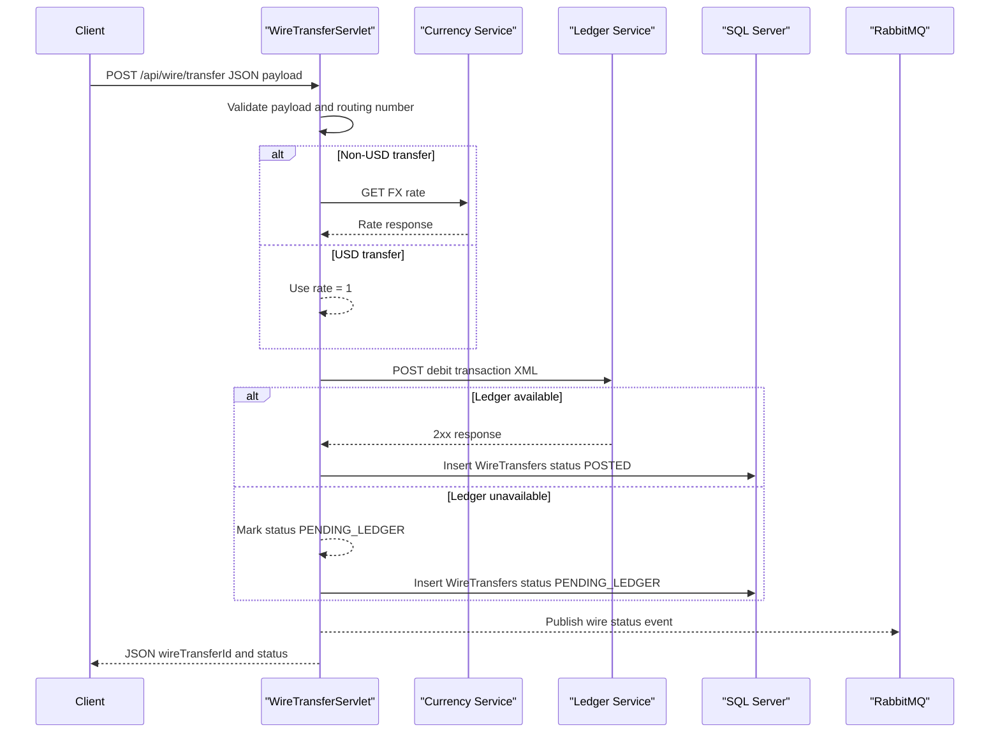

# API & Service Communication Contracts

This service exposes a small servlet-based HTTP API surface for wire transfer initiation and status lookup, with synchronous HTTP integrations and asynchronous RabbitMQ event publishing.

## Service Catalog

| Service | Port | Category | Purpose |
|---|---:|---|---|
| ZavaWireTransferService | 8080 | Business | Receives wire transfer requests, persists records, checks status, and publishes transfer events |

## API Endpoints Inventory

| Service | Method | Path | Request Type | Response Type |
|---|---|---|---|---|
| ZavaWireTransferService | GET | /health | None | HTML health page |
| ZavaWireTransferService | POST | /api/wire/transfer | JSON body (transfer payload) | JSON transfer result with status and reference |
| ZavaWireTransferService | GET | /api/wire/{id}/status | Path param id | JSON transfer status payload |

## Management & Observability Endpoints

| Service | Endpoint | Custom Metrics (if any) |
|---|---|---|
| ZavaWireTransferService | /health | None detected |

## DTOs & Contracts

The API contract is currently schema-by-convention through JSON and XML payloads rather than explicit DTO classes. `WireTransferServlet` consumes JSON transfer requests and returns JSON result payloads; `WireStatusServlet` returns JSON status payloads. For inter-service calls, ledger requests are serialized as XML strings and currency-rate responses are parsed from JSON. No OpenAPI, protobuf, or GraphQL contract files were detected.

## Communication Patterns

The application uses synchronous HTTP for calls to the currency service (rate lookup) and ledger service (debit posting), then publishes asynchronous topic events to RabbitMQ. No circuit breaker, retry framework, client-side load balancing, or service discovery mechanism is configured; downstream endpoints are resolved through explicit base URLs from configuration. Startup API availability depends on successful bootstrap table creation. Security posture at API contract level is minimal: no authentication, authorization, or TLS enforcement is defined in the application configuration.

## Service Technology Matrix

| Service | Web | Data Access | Discovery | Gateway | Actuator | Cache | Metrics |
|---|---|---|---|---|---|---|---|
| ZavaWireTransferService | Servlet API | JDBC | None | None | Custom health servlet | None | None detected |

## Service Communication Sequence

