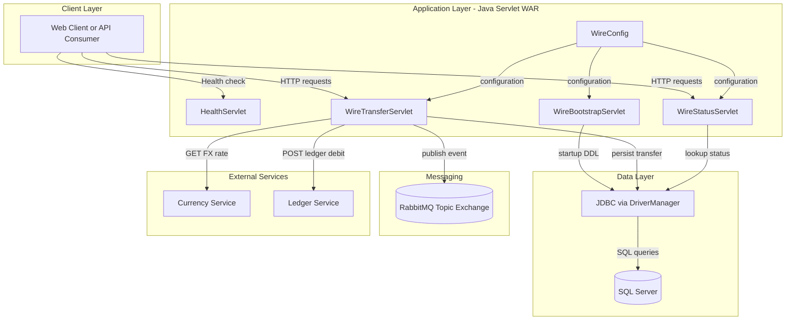
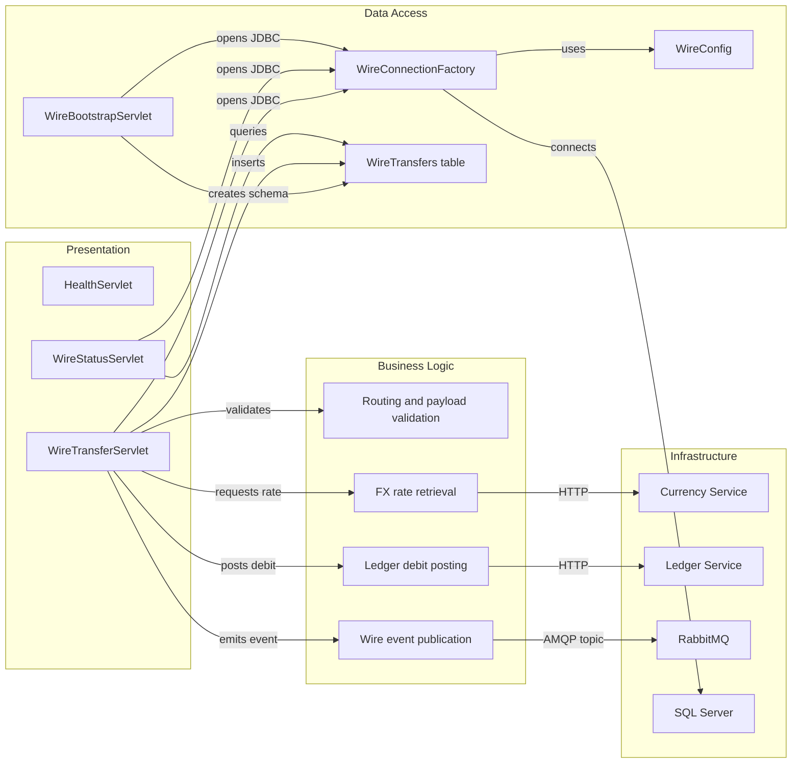

# Architecture Diagram

This document summarizes the current application architecture and key runtime components for ZavaWireTransferService.

## Application Architecture

### Technology Stack Summary

| Layer | Technology | Version | Purpose |
|---|---|---|---|
| Presentation | Java Servlet API | 4.0.1 | Exposes HTTP endpoints |
| Application | Java 11 | 11 | Core service runtime |
| Data Access | JDBC + SQL Server driver | 12.6.3.jre11 | Database connectivity |
| Messaging | RabbitMQ Java client | 5.20.0 | Event publishing |
| Build/Packaging | Gradle + WAR plugin | project-defined | Produces deployable WAR for Tomcat |

### Data Storage & External Services

The service stores wire transfer records in SQL Server using direct JDBC statements. It integrates with an external currency-rate API for FX conversion, a ledger API for debit posting, and RabbitMQ for asynchronous wire-transfer event publication.

### Key Architectural Decisions

- Uses classic servlet-based endpoints instead of a full Spring stack.
- Persists transactional data with explicit SQL statements and manual resource handling.
- External integrations are direct HTTP calls and RabbitMQ publish operations inside servlet flow.

## Component Relationships

### Component Inventory

| Component | Layer | Type | Responsibility |
|---|---|---|---|
| HealthServlet | Presentation | Servlet | Returns service health page |
| WireTransferServlet | Presentation | Servlet | Validates transfer requests and orchestrates transfer processing |
| WireStatusServlet | Presentation | Servlet | Reads persisted transfer status by id |
| WireBootstrapServlet | Data Access | Servlet initializer | Creates WireTransfers table at startup if missing |
| WireConnectionFactory | Data Access | Utility | Opens SQL Server JDBC connections |
| WireConfig | Data Access | Configuration utility | Resolves environment/property-based settings |
