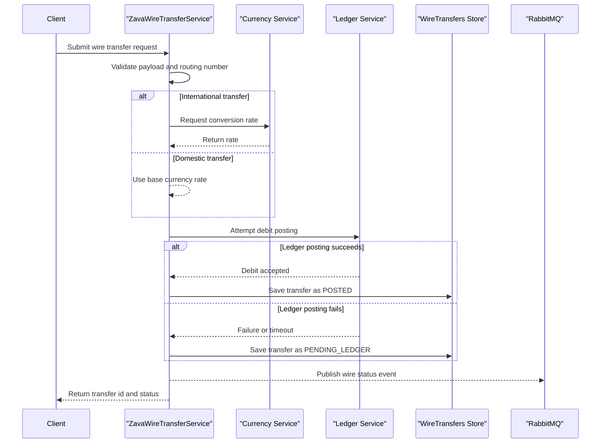

# Core Business Workflows

This application supports wire transfer initiation and status tracking, including settlement interaction with an external ledger and asynchronous event emission.

## Domain Entities

| Entity | Service / Bounded Context | Description | Key Relationships |
|---|---|---|---|
| WireTransfer | ZavaWireTransferService / Wire Processing | Represents a transfer request from initiation through settlement status | Linked to external ledger processing and internal status lifecycle |
| WireTransferEvent | ZavaWireTransferService / Integration Events | Represents outbound status notifications to downstream consumers | Produced from WireTransfer status transitions |

## Service-to-Domain Mapping

| Service | Domain Context | Owned Entities | External Dependencies |
|---|---|---|---|
| ZavaWireTransferService | Wire Processing | WireTransfer, WireTransferEvent | SQL Server, Currency Service, Ledger Service, RabbitMQ |

## Primary Workflows

### Workflow 1: Submit Wire Transfer

A client submits transfer data to `/api/wire/transfer`. The service validates required fields and routing format, determines FX behavior for non-USD transfers, attempts ledger debit posting, persists the wire transfer with status `POSTED` or `PENDING_LEDGER`, and then publishes a status event.

### Workflow 2: Check Wire Transfer Status

A client requests `/api/wire/{id}/status`. The service validates the URI format and identifier, loads the transfer from persistence, and returns the current status details or a not-found response.

## Cross-Service Data Flows

During transfer initiation, the service synchronously obtains FX rates (for international transfers) and attempts synchronous ledger posting before final persistence status is committed. After persistence, it asynchronously publishes a RabbitMQ event that can be consumed by downstream services. If ledger posting fails, business output degrades to `PENDING_LEDGER` while still returning a successful transfer creation response.

## Business Workflow Sequence

## Business Rules & Decision Logic

- Required input rule: request must include source account, beneficiary account details, beneficiary name, and positive amount.
- Routing rule: routing number must be a 9-digit value passing checksum validation.
- Currency rule: non-USD transfers trigger FX rate lookup; invalid FX lookup falls back to rate 1.
- Ledger decision rule: failed ledger posting sets persisted status to `PENDING_LEDGER` and records a failure reason.
- Status query rule: malformed status path or non-numeric id returns client error.
