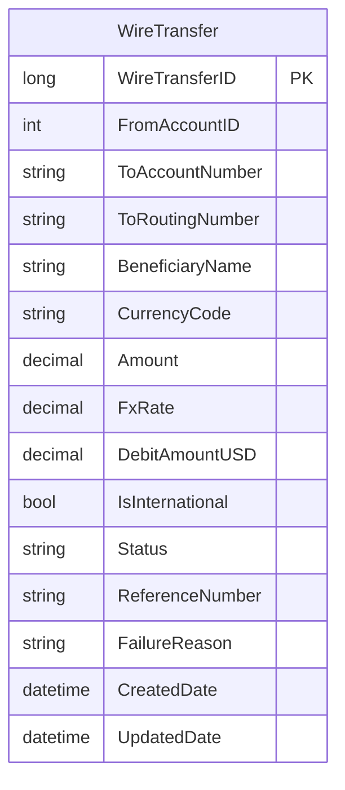

# Data Architecture & Persistence Layer

This service uses a single relational data store with direct JDBC persistence for wire transfer records and no ORM abstraction layer.

## Database Configuration

| Service/Module | DB Type | Profile | Driver | Connection | Migration Tool |
|---|---|---|---|---|---|
| ZavaWireTransferService | SQL Server | Default runtime | com.microsoft.sqlserver:mssql-jdbc 12.6.3.jre11 | JDBC URL built from host, port, and database settings | Startup DDL in WireBootstrapServlet |

## Data Ownership per Service

| Service | Tables Owned | ORM Framework | Caching | Notes |
|---|---|---|---|---|
| ZavaWireTransferService | WireTransfers | None (plain JDBC) | None | Table auto-created at startup when missing |

## Entity Model

## Key Repository Methods

| Service | Repository | Notable Methods | Purpose |
|---|---|---|---|
| ZavaWireTransferService | WireTransferServlet (JDBC persistence methods) | insertWireTransfer(...), SQL INSERT with generated key | Persists a new transfer request and returns generated identifier |
| ZavaWireTransferService | WireStatusServlet (JDBC query methods) | SELECT by WireTransferID | Retrieves persisted transfer state for status endpoint |
| ZavaWireTransferService | WireBootstrapServlet (startup DDL) | CREATE TABLE IF OBJECT_ID missing | Initializes schema on application startup |

## Caching Strategy

No application-side cache provider or cache abstraction was detected. Data is read and written directly through SQL Server and external service calls are executed per request.

## Data Ownership Boundaries

The application uses a single-service, single-database ownership model. All transfer persistence is owned by ZavaWireTransferService in the WireTransfers table, and cross-service data access is performed through HTTP integration with external ledger and currency services rather than direct database sharing.

### Data Classification & Sensitivity

| Entity | Sensitive Fields | Classification (PII/PHI/PCI/None) | Controls in Place |
|---|---|---|---|
| WireTransfer | BeneficiaryName, ToAccountNumber, ToRoutingNumber | PII | No explicit masking or field-level controls detected in code |
