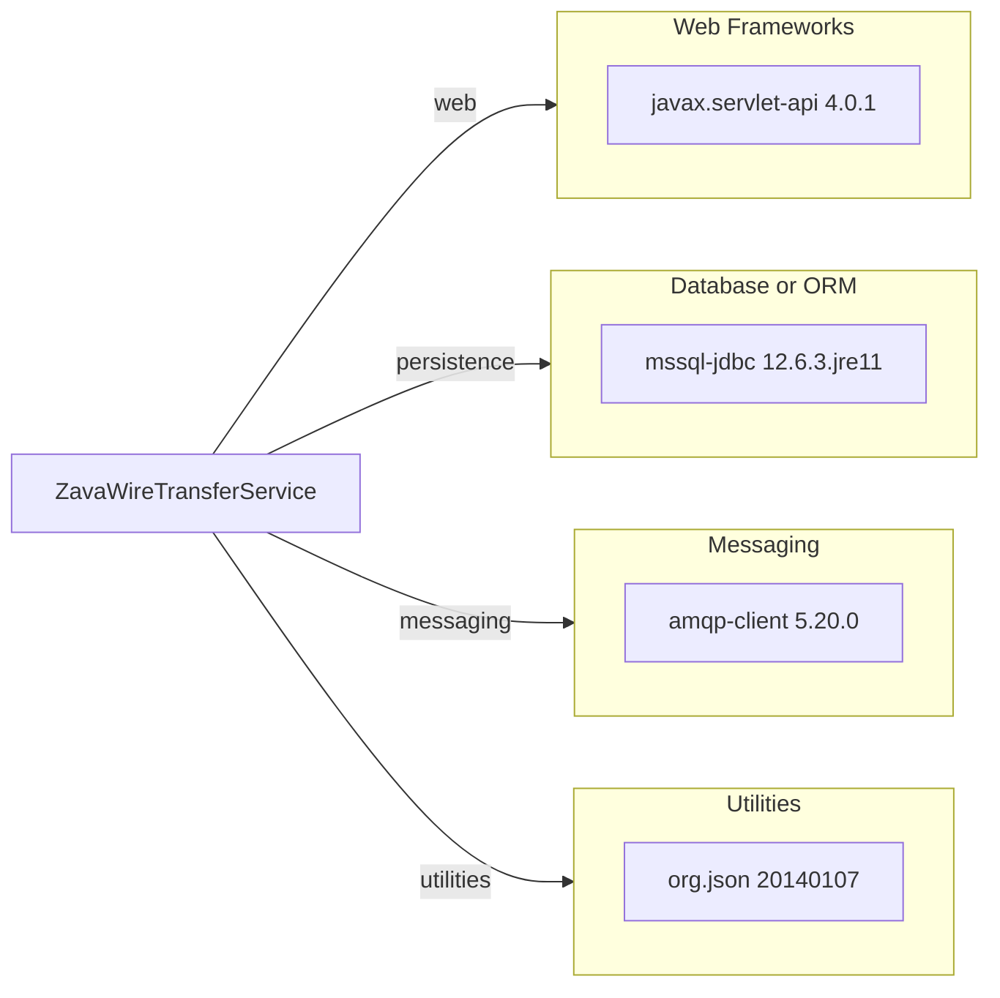

# Dependency Map

This document maps declared build dependencies for ZavaWireTransferService. The project declares 4 primary dependencies, grouped by functional role.

## Dependencies

### Dependency Summary

| Category | Count | Key Libraries | Notes |
|---|---:|---|---|
| Web Frameworks | 1 | javax.servlet-api 4.0.1 | Provided by container at runtime |
| Database or ORM | 1 | mssql-jdbc 12.6.3.jre11 | SQL Server connectivity |
| Messaging | 1 | amqp-client 5.20.0 | RabbitMQ publisher client |
| Utilities | 1 | org.json 20140107 | JSON request and response handling |

### Version & Compatibility Risks

The project targets Java 11 and uses a legacy `org.json` release (`20140107`), which is significantly old and may require compatibility and security review for modernization. The servlet API model is container-centric and may require adaptation for cloud-native runtime migration targets.

### Notable Observations

- No explicit logging library is declared; default container/application logging behavior is used.
- Dependency surface is intentionally small, which lowers migration complexity but increases custom-code responsibility.
- RabbitMQ support is direct client usage instead of framework abstraction.

## Test Dependencies

| Framework | Version | Notes |
|---|---|---|
| None detected | N/A | No test-scoped dependencies declared in build.gradle |

Total test-scope dependencies: 0
No test dependencies were detected in declared Gradle dependencies.
