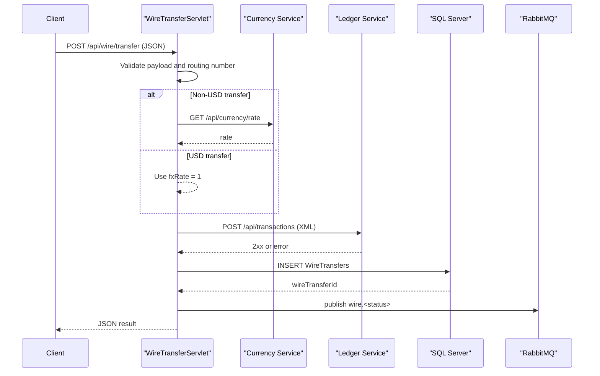

# API & Service Communication Contracts

This service exposes a small servlet-based API surface for wire transfer creation and status retrieval, with synchronous HTTP integrations and asynchronous event publishing.

## Service Catalog

| Service | Port | Category | Purpose |
|---|---:|---|---|
| ZavaWireTransferService | 8080 | Business | Accepts wire transfers and tracks status |
| zava-currency-service | 8080 | Business | Returns currency exchange rates |
| zava-ledger | 8080 | Business | Posts ledger debit transactions |
| RabbitMQ | 5672 | Infrastructure | Receives wire status events |

## API Endpoints Inventory

| Service | Method | Path | Request Type | Response Type |
|---|---|---|---|---|
| ZavaWireTransferService | POST | /api/wire/transfer | JSON body parsed into wire transfer payload | JSON status payload |
| ZavaWireTransferService | GET | /api/wire/{id}/status | Path parameter wire id | JSON transfer status payload |
| ZavaWireTransferService | GET | /health | None | HTML health page |

## Management & Observability Endpoints

| Service | Endpoint | Custom Metrics (if any) |
|---|---|---|
| ZavaWireTransferService | /health | None detected |

## DTOs & Contracts

Request/response contracts are represented as dynamic JSON objects (`org.json.JSONObject`) rather than typed DTO classes. The transfer request body includes account, routing, beneficiary, currency, and amount information; responses return generated transfer identifiers, status, and computed FX/debit values. Ledger integration sends XML payload text as an integration contract.

## Communication Patterns

Inbound communication is synchronous HTTP to servlet endpoints. The transfer flow performs synchronous outbound HTTP calls to currency and ledger services using `HttpURLConnection` with configured timeouts. After persistence, the service emits asynchronous RabbitMQ topic events. Service discovery is static (configured base URLs/hosts), and no API gateway or circuit-breaker library is present. No explicit authentication, authorization, or TLS enforcement is implemented at API contract level.

## Service Technology Matrix

| Service | Web | Data Access | Discovery | Gateway | Actuator | Cache | Metrics |
|---|---|---|---|---|---|---|---|
| ZavaWireTransferService | Servlet | JDBC | None | No | No | No | No |
| zava-currency-service | External HTTP | N/A | Static URL | No | Unknown | Unknown | Unknown |
| zava-ledger | External HTTP | N/A | Static URL | No | Unknown | Unknown | Unknown |

## Service Communication Sequence

