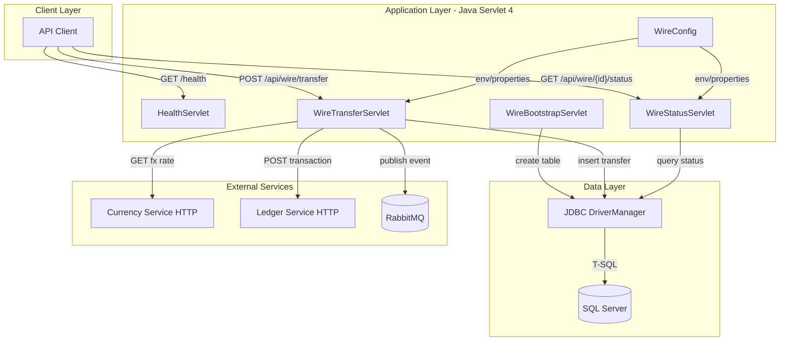
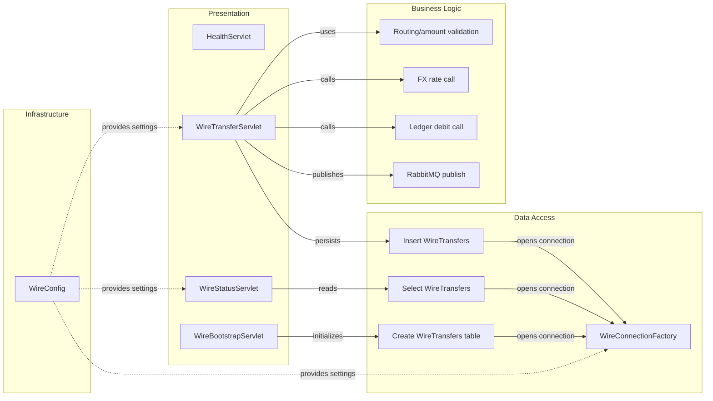

# Architecture Diagram

This document summarizes the application architecture and key component relationships for ZavaWireTransferService.

## Application Architecture

### Technology Stack Summary

| Layer | Technology | Version | Purpose |
|---|---|---|---|
| Presentation | Java Servlet API | 4.0.1 | HTTP endpoints |
| Business | Plain Java services in servlets | Java 11 | Transfer orchestration |
| Data Access | JDBC + SQL Server driver | 12.6.3.jre11 | Persistence of wire transfers |
| Messaging | RabbitMQ Java Client | 5.20.0 | Publish wire status events |

### Data Storage & External Services

The service persists wire transfer records in SQL Server using JDBC. It also depends on external HTTP services for FX rates and ledger posting, and publishes status events to RabbitMQ.

### Key Architectural Decisions

- Uses servlet-based endpoints with manual JSON handling and JDBC statements.
- Keeps configuration externalized through environment variables with property-file fallbacks.
- Publishes asynchronous wire-transfer events after persistence and ledger attempt.

## Component Relationships

### Component Inventory

| Component | Layer | Type | Responsibility |
|---|---|---|---|
| WireTransferServlet | Presentation | Servlet | Validates and executes wire transfer flow |
| WireStatusServlet | Presentation | Servlet | Returns persisted wire transfer status |
| HealthServlet | Presentation | Servlet | Basic service health page |
| WireBootstrapServlet | Presentation | Startup Servlet | Ensures table exists at startup |
| WireConnectionFactory | Data Access | Utility | Opens JDBC connections |
| WireConfig | Infrastructure | Config Utility | Resolves env/property configuration |
