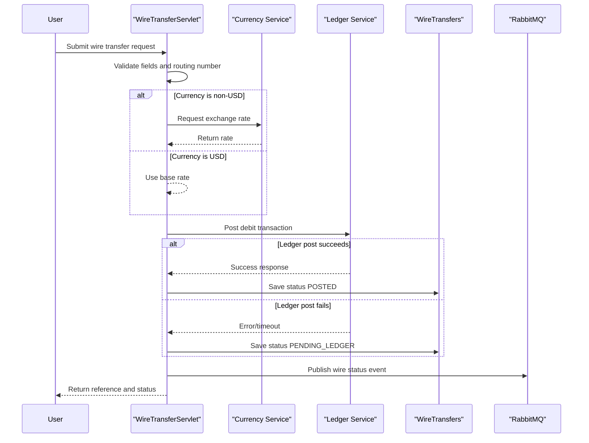

# Core Business Workflows

This service supports the wire transfer business process, including transfer initiation, status retrieval, and downstream ledger/event integration.

## Domain Entities

| Entity | Service / Bounded Context | Description | Key Relationships |
|---|---|---|---|
| WireTransfer | Wire Transfers | Represents a transfer request and settlement status | Linked to source account, beneficiary routing/account, and ledger posting result |
| LedgerTransaction (external) | Ledger | Represents debit booking request | Triggered by wire transfer execution |
| CurrencyRate (external) | FX | Represents conversion rate from USD to target currency | Used when transfer currency is non-USD |

## Service-to-Domain Mapping

| Service | Domain Context | Owned Entities | External Dependencies |
|---|---|---|---|
| ZavaWireTransferService | Wire Transfers | WireTransfer | Currency service, Ledger service, RabbitMQ, SQL Server |
| zava-currency-service | FX Rates | CurrencyRate | Called synchronously by wire service |
| zava-ledger | Ledger Posting | LedgerTransaction | Called synchronously by wire service |

## Primary Workflows

### Workflow 1: Submit Wire Transfer

Client submits transfer payload. Service validates required fields and routing number, calculates FX/debit amount, attempts ledger posting, persists transfer status, then emits an event to RabbitMQ.

### Workflow 2: Retrieve Wire Status

Client requests transfer status by id. Service validates URL format and id, queries persistence, and returns current status and reference metadata.

## Cross-Service Data Flows

The transfer workflow composes internal validation/persistence with two outbound HTTP dependencies: FX lookup (for non-USD transfers) and ledger posting. If ledger posting fails, transfer is still persisted with `PENDING_LEDGER` status and failure reason, reflecting degraded-but-recorded business outcome.

## Business Workflow Sequence

## Business Rules & Decision Logic

- Required request values: `fromAccountId`, destination account/routing, beneficiary name, and positive amount.
- Routing number must pass 9-digit checksum validation.
- Non-USD transfers request FX rate; invalid FX responses fall back to 1.
- Ledger posting outcome controls business status (`POSTED` vs `PENDING_LEDGER`).
