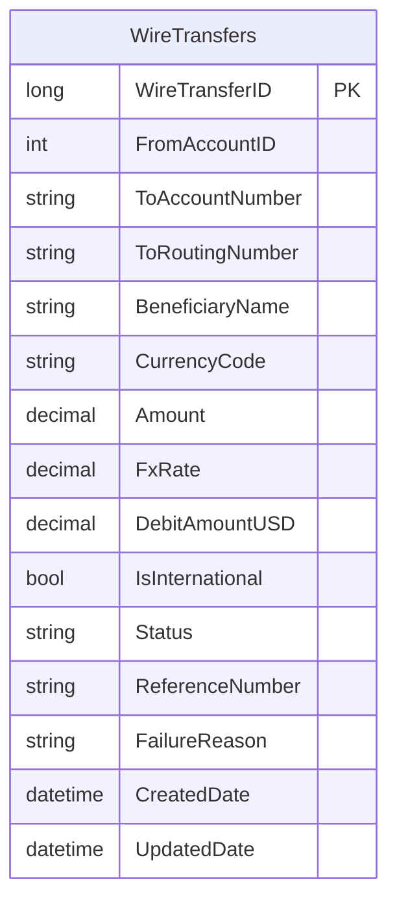

# Data Architecture & Persistence Layer

This service uses a single SQL Server table with JDBC-based persistence and no ORM entity framework.

## Database Configuration

| Service/Module | DB Type | Profile | Driver | Connection | Migration Tool |
|---|---|---|---|---|---|
| ZavaWireTransferService | SQL Server | default | mssql-jdbc 12.6.3.jre11 | JDBC URL built from env/properties | Startup DDL in `WireBootstrapServlet` |

## Data Ownership per Service

| Service | Tables Owned | ORM Framework | Caching | Notes |
|---|---|---|---|---|
| ZavaWireTransferService | WireTransfers | JDBC (no ORM) | None | Table created at servlet init if missing |

## Entity Model

## Key Repository Methods

| Service | Repository | Notable Methods | Purpose |
|---|---|---|---|
| ZavaWireTransferService | WireTransferServlet | `insertWireTransfer(...)` | Persists wire transfer rows |
| ZavaWireTransferService | WireStatusServlet | SQL select by `WireTransferID` | Fetches transfer status details |
| ZavaWireTransferService | WireBootstrapServlet | Startup CREATE TABLE statement | Ensures schema exists |

## Caching Strategy

No application-level caching layer was detected.

## Data Ownership Boundaries

The service owns and reads/writes the `WireTransfers` table directly in a single database context. Cross-service data access is API-based (currency and ledger calls) rather than direct database access.

### Data Classification & Sensitivity

| Entity | Sensitive Fields | Classification (PII/PHI/PCI/None) | Controls in Place |
|---|---|---|---|
| WireTransfers | BeneficiaryName, ToAccountNumber, ToRoutingNumber | PII | No explicit masking or encryption controls detected in code |
