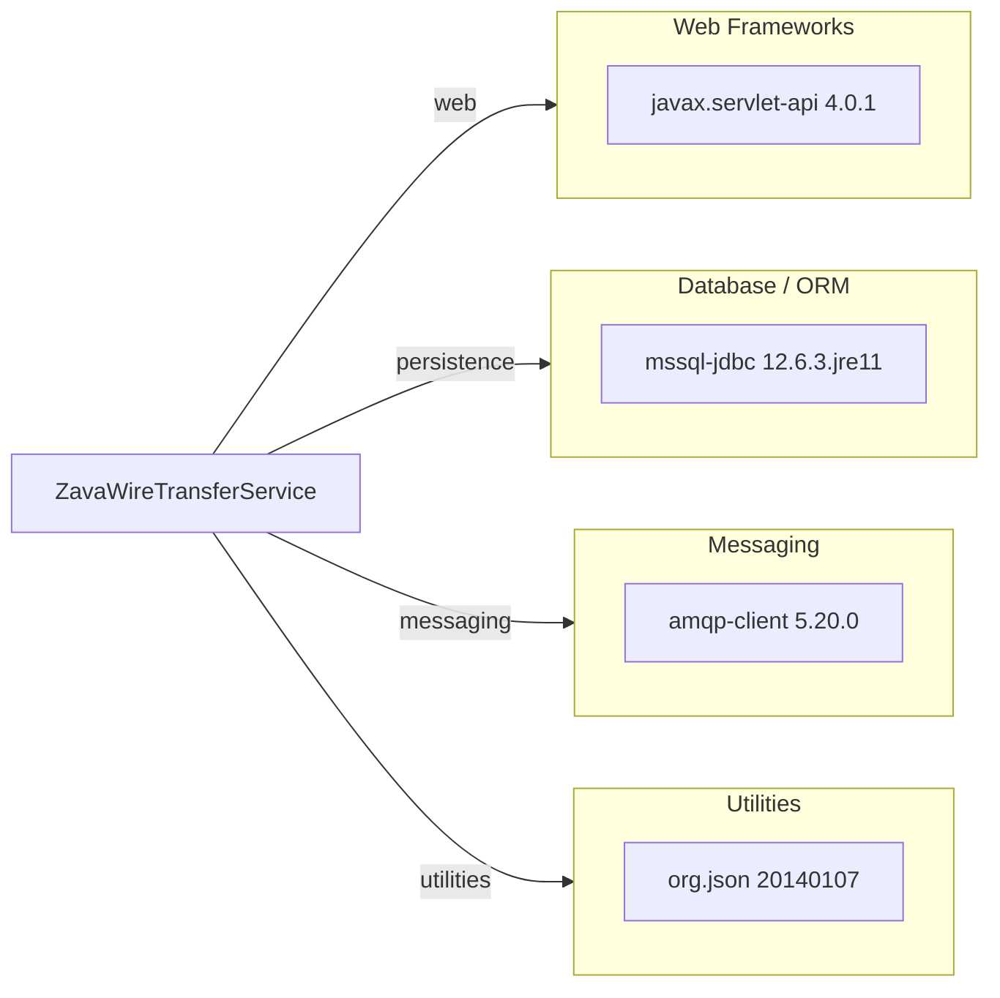

# Dependency Map

This map summarizes declared external dependencies for ZavaWireTransferService (4 runtime dependencies in Gradle).

## Dependencies

### Dependency Summary

| Category | Count | Key Libraries | Notes |
|---|---:|---|---|
| Web Frameworks | 1 | javax.servlet-api 4.0.1 | Provided servlet contract |
| Database / ORM | 1 | mssql-jdbc 12.6.3.jre11 | SQL Server connectivity |
| Messaging | 1 | amqp-client 5.20.0 | RabbitMQ event publication |
| Utilities | 1 | org.json 20140107 | JSON parsing/serialization |

### Version & Compatibility Risks

The project uses older library baselines (notably `org.json:20140107`) and legacy servlet deployment style, which may require dependency modernization for current enterprise platforms.

### Notable Observations

- No dedicated logging framework dependency is declared.
- No explicit security framework dependency is declared.
- Data access is raw JDBC without ORM abstraction.

## Test Dependencies

No test-scoped dependencies detected in `build.gradle`.

Total test-scope dependencies: 0
No dedicated test framework dependencies are declared.
